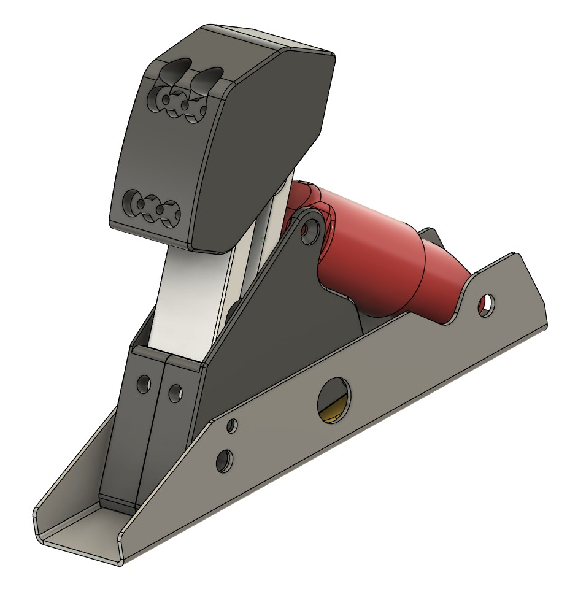

# Logitech G920 upgrades

Upgrades to Logitech G series wheel and pedals

## Load Cell Brake Pedal

    

Another variation on installing a beam type load cell in Logitech G series pedals.

Inspiration taken from [jstoezel/brake_pedal_beam_load_cell](https://github.com/jstoezel/brake_pedal_beam_load_cell) for mechanical parts and [Skidude88/Skidude88-G29-PS4-LoadCell-Arduino](https://github.com/Skidude88/Skidude88-G29-PS4-LoadCell-Arduino) for wiring and coding.
